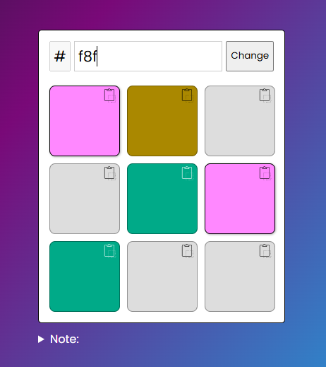

# Color Check Pallet

A simple web application that allows you to preview and copy hexadecimal color codes.

## 🔗 Live Demo

👉 [Check it out here]()

## Screenshot

## Features

- Input 3-digit or 6-digit hex color codes (with or without #)
- Preview colors on multiple boxes simultaneously
- Copy color codes to clipboard with one click
- Automatic icon color adjustment based on background brightness
- Keyboard-friendly navigation
- Responsive design

## How to Use

1. Type a hexadecimal color code (3 or 6 digits) in the input field
2. Click on the color boxes to select which ones to preview
3. Click the copy icon on any box to copy its color code to clipboard
4. Press "Change" or Enter to clear the input

## Keyboard Shortcuts

- Any hex character (0-9, A-F): Focuses the input field
- Enter: Clears the input field
- Backspace/Delete: Delete characters
- Arrow keys: Navigate within the input

## Technical Details

- Built with HTML, CSS, and vanilla JavaScript
- Uses the Poppins font from Google Fonts
- Responsive design that works on different screen sizes
- Clipboard API for copying color codes
- Color contrast algorithm to determine icon color (black or white)

## Installation

No installation required - just open the `index.html` file in any modern browser.

## Browser Support

The application should work in all modern browsers that support:

- CSS Grid
- Clipboard API
- ES6 JavaScript features

## Limitations

- Currently only supports hexadecimal color codes
- Input limited to 6 characters (for hex codes)

## Future Improvements

- Support for RGB/RGBA/HSL color formats
- Color palette generation
- Save favorite colors
- Share color palettes

## License

This project is open source.
